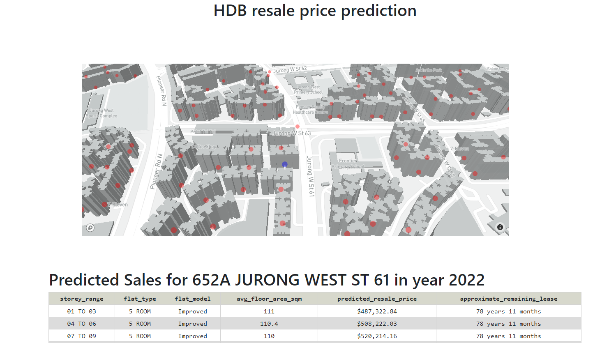

## HDB resale price prediction
In this project, we will be predicting hdb resale price in 2022 using datasets provided by data.gov. After making the prediction, we will present the data on a "3D mapbox map". I will be showcasing how to create a full pipeline in sklearn pipeline by making use of sklearn base class like transformerMixin and BaseEstimator. After which, we will be using lightgbm for fitting and optuna for automatic hyperparameter search. After we have found the optimium hyperparamter, we will be using 10fold CV and ensembling for making the predictions

## Technogies used
1. mapbox api
2. heroku
3. plotly dash
4. lightgbm
5. optuna

## DEMO

***Note the app will take some time to start as the app goes into sleep after some inactivity
https://hdb-resale-prediction.herokuapp.com/

## HDB property dataset
https://data.gov.sg/dataset/hdb-property-information

## HDB resale price dataset
https://data.gov.sg/dataset/resale-flat-prices